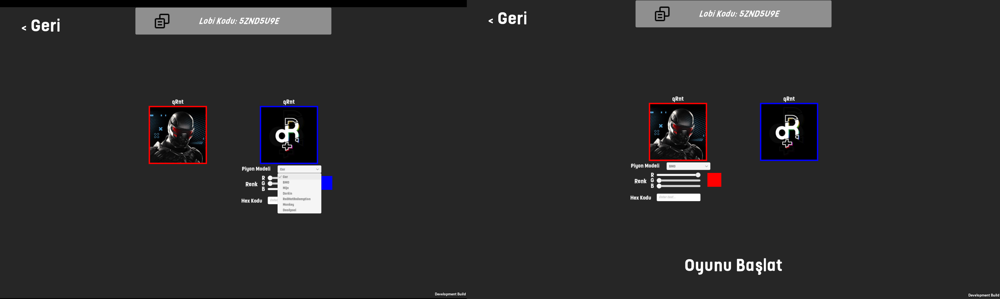
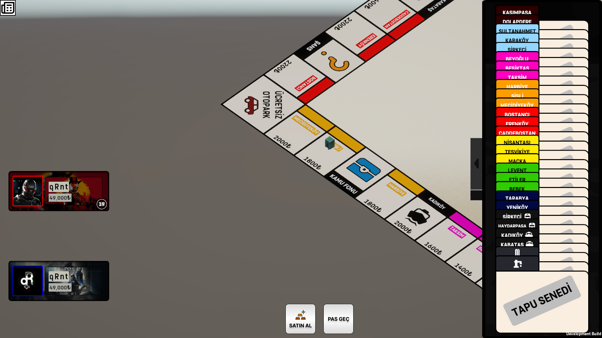

[ TR ] | [ [English](README.md) ]

<h3 align="center">📷 Oyun İçi Ekran Görüntüleri</h3>

<table>
  <tr>
    <td width="50%" align="center">
      <br/>
      <b>Lobi</b>
    </td>
    <td width="50%" align="center">
      <br/>
      <b>Oyun Tahtası & Hareket Mekaniği</b>
    </td>
  </tr>
  <tr>
    <td width="50%" align="center">
      <br/>
      <b>Satın Alınmış Arsa</b>
    </td>
    <td width="50%" align="center">
      <br/>
      <b>Sağ Panel Tapu Detayları</b>
    </td>
  </tr>
</table>

# 🎲 Monopoly Multiplayer (Unity & Mirror Networking)


Klasik Monopoly oyunu mekaniklerinin, **Unity Engine** ve **Mirror Networking** kullanılarak sunucu yetkili (*Authoritative Server*) mimarisiyle yeniden geliştirildiği çok oyunculu (Multiplayer) masa oyunu projesi.

---

## 📌 Öne Çıkan Özellikler

* **Authoritative Server Mimarisi:** Hile yapılmasını engellemek ve senkronizasyon hatalarını önlemek adına tüm oyun lojiği, zar atışları, tapu satın alımları ve sıra takibi doğrudan sunucu (Server) üzerinde doğrulanır ve yürütülür.
* **Ağ Tabanlı Tur & Zamanlayıcı Yönetimi (Turn & Timer System):** Oyuncular için 30 saniyelik dinamik zamanlayıcı. Süre dolduğunda veya oyuncu eylemsiz kaldığında devreye giren otomatik zar atma ve tur atlama mekanizmaları.
* **Dinamik Tapu ve Ekonomi Sistemi:** Oyuncu bakiye takibi, mülk satın alma, kira ödeme ve iflas (`Bankrupt`) mekanizmaları.
* **Race Condition & State Guarding:** İstemci (Client) ve Sunucu arasındaki gecikmelerden (latency) kaynaklanabilecek çift tetiklenme (double-skip) ve bellek sızıntıları (NullReference) mimari seviyede engellenmiştir.

---

## 🛠️ Teknik Mimari ve Kullanılan Teknolojiler

* **Game Engine:** Unity
* **Language:** C#
* **Networking Framework:** Mirror Networking
* **Network Topolojisi:** Host-Client (Listen Server)

### Mimari Yaklaşım

| Bileşen | Görevi / Sorumluluğu |
| :--- | :--- |
| **`GameManager`** | Oyunun ana durum makinesini (State Machine) yönetir. Oyuncu sırası, tur zamanlayıcısı, pause durumları ve kazanma koşullarından sorumludur. |
| **`PlayerScript`** | NetworkIdentity bileşenine bağlı olan oyuncu veri modelidir. Bakiye, mülk listesi ve tur durum kilitlerini senkronize tutar. |
| **`TurnManager`** | Turların geçiş akışını kilitler (locking) ve ağ üzerindeki tüm client'lara doğru sıra bilgisini aktarır. |

---

## 🚀 Önemli Teknik Zorluklar ve Çözümler

Bu projeyi geliştirirken karşılaşılan ve çözüme kavuşturulan temel ağ yönetimi (Networking) problemleri:

### 1. Update Döngüsünde Çift Tetiklenme (Double Turn Pass)
* **Problem:** Zamanlayıcı (Timer) sıfırlandığında `Update()` döngüsünün sonraki karelerde (frame) ağ paketlerinden daha hızlı çalışması sebebiyle turun arka arkaya iki kez atlanması.
* **Çözüm:** Zamanlayıcı sıfırlandığı an durum kilitlenmiş, `ServerExecutePass` gibi tek noktadan yönetilen (Single Source of Truth) yetkili metotlar üzerinden durum yönetimi sağlanarak Race Condition engellenmiştir.

### 2. Ağ Bağlantısı Kopmalarında Graceful Shutdown (Null-Guard)
* **Problem:** Sunucu kapandığında veya client ayrıldığında ağ nesnelerinin hafızadan silinme süreci ile `Update` döngüsünün çakışarak `NullReferenceException` fırlatması.
* **Çözüm:** Durum sorgularında defensively-coded (savunmacı) null-check katmanları eklenerek konsol loglarının temiz kalması ve sunucunun kararlı şekilde kapanması sağlanmıştır.

---

## 🎮 Kurulum ve Çalıştırma

Projeyi yerel makinenizde test etmek ve derlemek için:

1. Depoyu klonlayın:
   ```bash
   git clone https://github.com/BioKZM/Monopoly.git
   ```
2. Unity Hub üzerinden projeyi açın (multiplayer dalını (branch) seçtiğinizden emin olun).

3. Assets/Monopoly/Scenes/ dizinindeki Ana Sahneyi açın.

4. Çok oyunculu testi gerçekleştirmek için ParrelSync eklentisini kullanabilir veya File > Build and Run adımıyla ikinci bir İstemci (Client) oluşturabilirsiniz.
